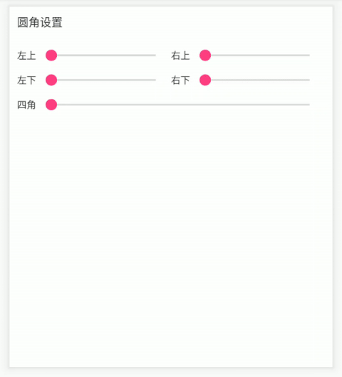
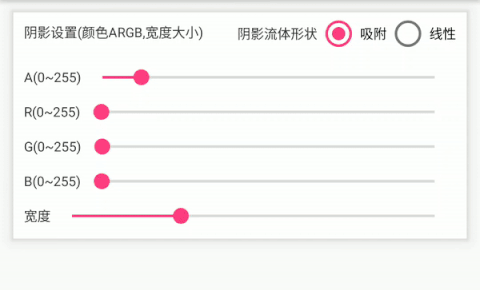
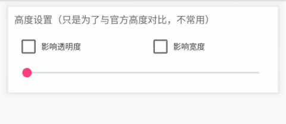
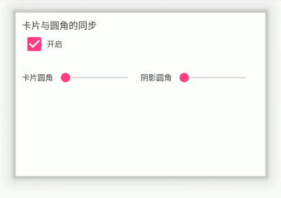
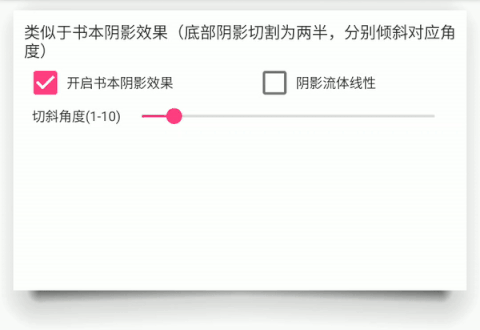
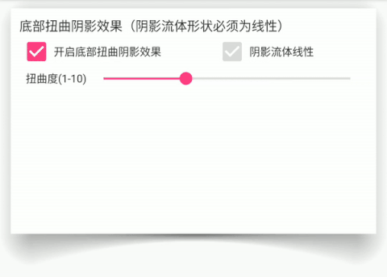

# LCardView 
卡片布局，可设置阴影颜色，透明度，圆角大小，阴影宽度，阴影偏移量，卡片圆角/阴影圆角独立设置，特殊阴影效果，底部阴影扭曲效果等。 

### Java gradle dependencies：
~~~groovy
dependencies {
    implementation 'org.linwg1988:lcardview:1.5.4'
}
~~~

### Kotlin gradle dependencies：
~~~groovy
dependencies {
    implementation 'io.github.linwg1988:lcardview-kt:1.0.4'
}
~~~

Kotlin 版本1.0.2 新增了部分属性(描边，渐变色等)，可有效减少shape.xml的创建 
现在卡片式的设计还是比较常见的，设计师们常常天马行空的设计出各种好看(emmm)的的卡片样式，但是安卓原生的CardView的局限性还是比较大的，比如没办法设置阴影的颜色，阴影的透明度等等等等；那既要满足设计师们的要求且又不往包里面添加.9图片使,那可以试试这款卡片布局。<a href="screenshot/demo.apk" target="_blank">demo.apk</a> 

LCardView继承FrameLayout,使用方式与之并没有什么太大区别，下面一些动图将展示LCardView具有哪些功能:

#### cornerRadius
 * 可单独设置也可同时设置圆角半径。

### shadowOffset
 * 可单独或同时设置4边的偏移量，偏移量为正时往外偏移，最大值为阴影宽度的一半，偏移量为负时往内偏移。
 

### leftShadowDecrement & topShadowDecrement & rightShadowDecrement & bottomShadowDecrement
* 可设置4边阴影的缩减尺寸，最大值为阴影宽度，该设置不会影响阴影所在的位置。

### cardBackground
* 卡片背景，和cardBackgroundColor相比，可以设置图片或者Drawable文件。

### gradientColors
* 卡片背景渐变色，xml中以英文逗号分隔，可避免创建drawable文件。

### gradientDirection
* 卡片背景渐变色方向。

### gradientSizeFollowView
* 卡片背景渐变色尺寸是否与控件尺寸一致（斜方向时配置）,若false,渐变色的形状大小为边长为最大长宽的一个正方形。

### shadowColor/shadowAlpha
 * 阴影的颜色与透明度分开设置，所以设置 **shadowColor(color:Int)** 时参数 color 的 alpha 是不起作用的，要设置透明度需使用 **setShadowAlpha(alpha:Int)** 。
 

 
### elevation
 * 顾名思义卡片高度，此参数可作用于透明度以及阴影宽度，改参数不改变 View 本身的 elevation 属性。
 

### paperSyncCorner & paperCorner
 * 有时候卡片本身我们不想设置圆角，但是我们(**真的是我们而不是设计师?**)又希望阴影的圆角比较大，这个属性就起作用了，更进一步你可以为卡片和阴影分别设置不同的圆角半径(相信应该没有人会觉得卡片半径大于阴影半径好看吧)。
 * **现仅 kotlin 库支持**
 

### linearBookEffect & bookRadius
 * emmm,要怎么说呢,还是看图吧，图片看不了的话就下载一个 demo 看看效果吧，如果对这个效果感兴趣的话。
 * **现仅 kotlin 库支持**
 

### curveShadowEffect & curvature
 * 这个效果还是蛮酷的，使卡片更加具有立体感了，我个人灰常中意它。
 * **现仅 kotlin 库支持**
 

### useShadowPool & bindLifeCircle
 * 这两个属性适用于同样式卡片的列表，如果启用 **shadowPool** 缓存，着色器与 Bitmap 只会被第一张卡片创建，其余的都将复用缓存池中的对象，减少内存开销，由于缓存对象位于静态池中，页面销毁时需要解除卡片的缓存池对象引用，推荐使用 **bindLifeCircle** 属性使卡片与页面邦定，使页面销毁时自动移除引用，但是如果没有绑定生命周期也没有关系,LCardView 在 attach 与 detach 时会自动建立/移除引用关系（或许增加了查询开销??）。
 * **现仅 kotlin 库支持**
 
 
 
 ### other
 * **propterties()** 提供了一个可以链式设置卡片多种属性的方案，只在最后一次设置属性时重建阴影并重绘，减少对象创建优化了内存开销。
 * **fixedContentWidth/fixedContentHeight** 改变卡片的测量方式，底下版本日志有解释，比较不常用就不多说了。
 * 以上所有属性大可同时设置，撸出你(or设计师)想要的效果，放心的让设计师随便改阴影了，我们完全不慌。

属性说明： 

| xml属性名称                         | 中文释义                       |
|---------------------------------|----------------------------|
| attr:shadowSize                 | 四边阴影宽度                     |
| attr:shadowStartAlpha           | 阴影颜色初始透明度                  |
| attr:shadowFluidShape           | 阴影流动形状（线性/吸附）              |
| attr:shadowColor                | 阴影颜色RGB值（透明度此处无效）          |
| attr:cardBackgroundColor        | 卡片背景色                      |
| attr:cornerRadius               | 阴影圆角半径                     |
| attr:leftTopCornerRadius        | 左上圆角半径                     |
| attr:rightTopCornerRadius       | 右上圆角半径                     |
| attr:leftBottomCornerRadius     | 左下圆角半径                     |
| attr:rightBottomCornerRadius    | 右下圆角半径                     |
| attr:elevation                  | 卡片高度                       |
| attr:elevationAffectShadowColor | 卡片高度是否影响阴影颜色               |
| attr:elevationAffectShadowSize  | 卡片高度是否影响阴影宽度               |
| attr:leftOffset                 | 卡片左半区阴影偏移量                 |
| attr:rightOffset                | 卡片右半区阴影偏移量                 |
| attr:topOffset                  | 卡片上半区阴影偏移量                 |
| attr:bottomOffset               | 卡片右半区阴影偏移量                 |
| attr:fixedContentWidth          | 控件宽度是否固定为内容宽度              |
| attr:fixedContentHeight         | 控件高度是否固定为内容高度              |
| attr:paperSyncCorner            | 同步卡片圆角与阴影圆角大小              |
| attr:paperCorner                | 卡片圆角半径                     |
| attr:linearBookEffect           | 线性书本阴影效果                   |
| attr:bookRadius                 | 线性书本阴影偏移倍率（底部阴影宽度）         |
| attr:curveShadowEffect          | 底部阴影扭曲效果                   |
| attr:curvature                  | 底部阴影扭曲率                    |
| attr:useShadowPool              | 是否启用阴影缓存池                  |
| attr:bindLifeCircle             | 是否绑定生命周期                   |
| attr:cardBackground             | 卡片背景                       |
| attr:gradientColors             | 卡片背景渐变色                    |
| attr:gradientSizeFollowView     | 卡片背景渐变色尺寸是否与控件尺寸一致（斜方向时配置） |
| attr:gradientDirection          | 卡片背景渐变色方向                  |
| attr:strokeWidth                | 描边尺寸                       |
| attr:strokeColor                | 描边颜色                       |
| attr:leftShadowDecrement        | 左侧阴影缩减尺寸                   |
| attr:topShadowDecrement         | 顶部阴影缩减尺寸                   |
| attr:rightShadowDecrement       | 右侧阴影缩减尺寸                   |
| attr:bottomShadowDecrement      | 底部阴影缩减尺寸                   |

## Change Logs.

### Kotlin版本

### 1.0.4
* bug 修复:修复底部阴影在卡片高度变化时重建的情况；
* 因shadowDecrement参数影响，阴影实际绘制的区域如果为空或被其它内容覆盖，则不参与绘制过程

### 1.0.3
* 一些 bug 修复，圆角精度改为浮点类型，最大圆角自动修正为最小宽高的一半，避免阴影重叠；
* 底部扭曲不在限制阴影形状；
* 阴影 bitmap 缓存池修改，最大限制从个数改为实际占用内存；
* 新增属性 leftShadowDecrement,topShadowDecrement,rightShadowDecrement,bottomShadowDecrement 可对四边阴影的宽度进行缩减，
* 相对于 showDowOffset 属性来说，阴影宽度的缩减不会导致阴影位置的变化，但会对阴影的圆角进行扭曲；
* 调整 bookRadius 属性，设置后底部阴影中间会在往上扭曲（阴影宽度 size * bookRadius），并往两侧线性递减

### 1.0.2
* bug修复；

### 1.0.1
* 新增卡片背景属性cardBackground，使用方式与android:background一致，cardBackground只会在卡片的内容区域绘制；
* 新增描边属性（strokeColor & strokeWidth），背景渐变色属性（gradientColors & gradientDirection & gradientSizeFollowView）
* 便于直接创建描边控件，减少项目中xml的创建；
* 背景属性的优先级 cardBackgroundColor > gradientColors > cardBackground;
* 修复在部分场景下出现的锯齿情况或者阴影重叠或描边缺失的问题；

### 0.0.1
 * 新增卡片圆角与阴影圆角是否同步的属性，自由度更高
 * 新增底部线性类似于书本阴影的效果（不要吐槽命名）
 * 新增底部类似扭曲阴影的效果（同上，不要吐槽）
 * 新增 **properties()** 方法，链式设置多个属性，单次修改阴影实例
 * 去除部分场景下的无效绘制，优化绘制速度
 * 新增卡片列表使用时阴影重复使用的支持，依赖于缓存池，且自动绑定生命周期

### Java版本
### 1.5.4
 * 新增属性 fixedContentWidth,fixedContentHeight.使用场景：卡片布局的父布局因为动画需要大小动态变化来对卡片布局进行隐藏或显示，
 * 若卡片尺寸是根据内部子控件大小来获得，卡片尺寸属性设置为 wrap_content,此时卡片的父布局动态修改尺寸时会导致卡片重新测量大小。该属
 * 性值为 true 时，父布局的大小不影响卡片的测量内部子控件的结果，故而也不会触发阴影重新创建以及内容的裁切大小。

### 1.5.2
 * 优化阴影创建的条件，只有在参数变化时才重新创建，修复View在没有测量完成时设置卡片属性导致的阴影异常,去除setShadowOffset()方法。
 
### 1.5.0
 * 此版本已经弃用四边阴影宽度分别设置的方法。
 * 对于阴影偏移的实现进行修改替换，分为上、下、左、右四个区域，
 * 偏移的数值为正，则从卡片中心向外偏移，
 * 偏移的数值为负，则从卡片中心向内偏移，
 * 你可以使用: **setShadowOffsetCenter(offset)** 进行以卡片中心的整体偏移。
 
### 1.4.2
 * 修复因为偏移属性的增加导致阴影透明度影响背景色的问题
 * 控件存在的局限性：四边阴影大小不一的时候无法设置圆角；
 * 同理设置圆角大小的时候四边的阴影大小会自动恢复成初始值
 
### 1.4.1
 * 修复Android P圆角失效的问题
 
### 1.4
 * 增加了X轴和Y轴偏移量属性,暂时只允许偏移至边缘位置。
 
### 1.2
 * 新增了一些xml初始化属性，让布局在xml中更加直观。

